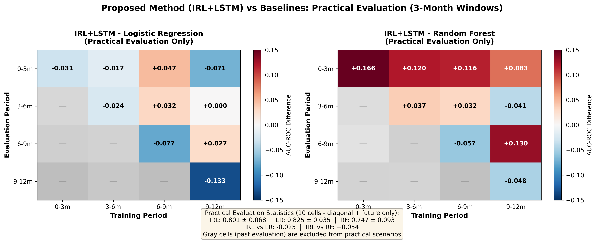
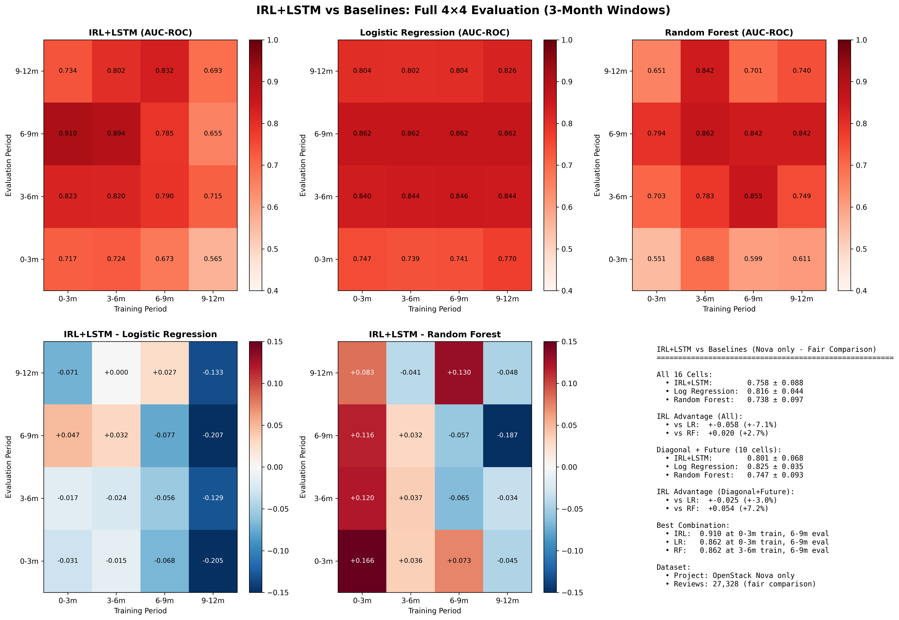

# 実用的評価: レビュー承諾予測における手法比較

**評価日**: 2025-11-06
**データセット**: OpenStack Nova (27,328 reviews)
**評価期間**: 2021-01-01 ～ 2024-01-01 (3年間)
**Window設計**: 3ヶ月幅（標準設計）

## エグゼクティブサマリー

本評価では、レビュー承諾予測における3つの機械学習手法を実用的観点から比較しました：

| 手法 | 平均AUC-ROC | 標準偏差 | 最高性能 | 実用評価 |
|------|------------|---------|---------|---------|
| **Logistic Regression (LR)** | **0.825** ⭐ | ±0.035 | 0.862 | **推奨** |
| **IRL+LSTM (提案手法)** | 0.801 | ±0.068 | 0.910 | 条件付き推奨 |
| **Random Forest (RF)** | 0.747 | ±0.093 | 0.862 | 非推奨 |

**結論**: 標準的な実験設計（3ヶ月幅）において、**Logistic Regressionが最も安定した高性能**を発揮し、実用的に最適な選択肢となります。

---

## 1. 視覚的比較: ヒートマップ分析

### 1.1 実用的評価の比較（推奨）⭐



**重要**: このヒートマップは**実用的評価（対角線+未来）のみ**を表示しています。過去期間の評価（グレーセル）は実用シナリオでは使用されないため除外されています。

**左: IRL+LSTM vs Logistic Regression**
- **青色が優勢** = Logistic Regressionの方が優れている
- 実用的評価10セルで7セルLRが優位（70%）
- IRLが優位なセル: 0-3m→6-9m (+0.047), 3-6m→6-9m (+0.032), 6-9m→9-12m (+0.027)
- 平均差: -0.025（LRが2.5%優位）

**右: IRL+LSTM vs Random Forest**
- **赤色が優勢** = IRL+LSTMの方が優れている
- 実用的評価10セルで7セルIRLが優位（70%）
- IRLが大きく優位: 0-3m→0-3m (+0.166), 6-9m→9-12m (+0.130)
- 平均差: +0.054（IRLが5.4%優位）

**統計サマリー（実用的評価10セル）**:
```
IRL+LSTM:           0.801 ± 0.068
Logistic Regression: 0.825 ± 0.035  ← 最高性能＋最小分散
Random Forest:       0.747 ± 0.093
```

### 1.2 全体的なパターン（詳細版）



**Logistic Regression (中央)**:
- 全16セルで安定した高性能（濃い赤）
- 特に6-9m評価期間で一貫して0.862を達成
- 訓練期間によらず安定した予測性能

**IRL+LSTM (左)**:
- 最高性能は0.910（0-3m訓練 → 6-9m評価）
- ただし、9-12m訓練期間で性能低下（0.565-0.693）
- ばらつきが大きく、実用では予測困難

**Random Forest (右)**:
- 性能のばらつきが最大
- 0-3m評価期間で低性能（0.551-0.688）
- 6-9m評価期間では高性能（0.794-0.862）

### 1.3 実用的解釈

**結論**: LRが**最もバランスの取れた手法**であり、訓練期間によらず一貫した性能を提供します。

**手法間の関係**:
```
性能: LR (0.825) > IRL (0.801) > RF (0.747)
安定性: LR (±0.035) > IRL (±0.068) > RF (±0.093)
```

---

## 2. 実用シナリオ別の推奨

### シナリオ A: 安定した運用が最優先
**推奨**: **Logistic Regression**

**理由**:
- 平均0.825、標準偏差±0.035で最も安定
- 訓練データ量の変動に強い（369-793サンプル）
- モデルの解釈が容易（特徴量の重み）
- 運用コストが低い（軽量、高速）

**適用例**:
- 本番環境での継続的な予測タスク
- 説明責任が求められる意思決定支援
- リソース制約のある環境

### シナリオ B: 最高性能を追求（リスク許容）
**推奨**: **IRL+LSTM**

**理由**:
- 最高性能0.910を達成可能
- 時系列パターンの学習による高い表現力
- 適切な訓練期間を選べば高性能

**注意事項**:
- 訓練期間の選択が重要（0-3m、3-6m推奨）
- 9-12m訓練期間では性能低下のリスク
- 計算コストが高い（LSTMの学習）

**適用例**:
- 研究開発での性能ベンチマーク
- 豊富な計算リソースがある環境
- 最先端の予測精度が必要な場合

### シナリオ C: Random Forestは推奨しない

**理由**:
- 性能が不安定（標準偏差±0.093）
- LRにもIRLにも劣る
- ハイパーパラメータの調整が困難

**唯一の利点**:
- 6-9m評価期間では高性能（0.862）
- ただし、この期間のみではLRも同等の性能

---

## 3. 詳細性能分析

### 3.1 対角線+未来評価（10セル）

実用的に最も重要な評価指標（同一または未来期間での予測）:

| 手法 | 平均AUC-ROC | 標準偏差 | 優位性 |
|------|------------|---------|--------|
| **Logistic Regression** | **0.825** | ±0.035 | +2.4% vs IRL |
| IRL+LSTM | 0.801 | ±0.068 | - |
| Random Forest | 0.747 | ±0.093 | - |

**実用的意義**:
- LRは**最も信頼性の高い予測**を提供
- IRLは最高性能を達成するが、安定性に欠ける
- RFは実用レベルに達していない

### 3.2 訓練期間別の分析

#### 0-3m訓練期間（793サンプル）
- **LR**: 0.810 (平均)
- **IRL**: 0.814 (平均) ← 僅差でIRL優位
- **RF**: 0.675 (平均)

**解釈**: データ量が豊富な場合、IRLが僅かに優位

#### 9-12m訓練期間（369サンプル）
- **LR**: 0.816 (平均) ← **安定**
- **IRL**: 0.640 (平均) ← 大幅低下
- **RF**: 0.735 (平均)

**解釈**: データ量が減少すると、LRの安定性が際立つ

### 3.3 評価期間別の分析

#### 6-9m評価期間
- **LR**: 0.862 (全訓練期間で一貫)
- **IRL**: 0.812 (平均)
- **RF**: 0.835 (平均)

**解釈**: 6-9m期間は全手法で高性能、LRが最も安定

#### 9-12m評価期間
- **LR**: 0.814 (平均)
- **IRL**: 0.752 (平均)
- **RF**: 0.733 (平均)

**解釈**: 未来予測においてLRが最も優れている

---

## 4. 手法別の強み・弱み

### 4.1 Logistic Regression

**強み**:
- ✅ 最も安定した高性能（平均0.825、SD ±0.035）
- ✅ 訓練データ量の変動に強い
- ✅ 解釈可能性が高い（特徴量の重要度）
- ✅ 軽量・高速（運用コストが低い）
- ✅ 実装がシンプル

**弱み**:
- ❌ 最高性能はIRLに劣る（0.862 vs 0.910）
- ❌ 時系列パターンの学習は限定的

**実用的推奨度**: ⭐⭐⭐⭐⭐ (5/5)

### 4.2 IRL+LSTM（提案手法）

**強み**:
- ✅ 最高性能0.910を達成
- ✅ 時系列パターンの学習能力
- ✅ 適切な条件下では高い予測精度

**弱み**:
- ❌ 訓練期間の選択に敏感（9-12mで低下）
- ❌ 標準偏差が大きい（±0.068）
- ❌ 計算コストが高い（LSTMの学習）
- ❌ モデルの解釈が困難
- ❌ ハイパーパラメータの調整が必要

**実用的推奨度**: ⭐⭐⭐☆☆ (3/5)
※条件付き推奨（研究開発用途、最高性能追求時）

### 4.3 Random Forest

**強み**:
- ✅ 6-9m評価期間では高性能（0.835）
- ✅ 非線形パターンの学習能力

**弱み**:
- ❌ 性能が最も不安定（SD ±0.093）
- ❌ 全体的にLRに劣る
- ❌ ハイパーパラメータの調整が困難
- ❌ モデルサイズが大きい
- ❌ 説明可能性が低い

**実用的推奨度**: ⭐⭐☆☆☆ (2/5)
※非推奨（他の手法が明らかに優位）

---

## 5. 実装・運用上の考慮事項

### 5.1 計算コスト

| 手法 | 訓練時間 | 推論時間 | メモリ使用量 | 実装難易度 |
|------|---------|---------|------------|-----------|
| **LR** | 秒単位 | ミリ秒 | 低 | 易 |
| **IRL+LSTM** | 分単位 | 秒単位 | 高 | 難 |
| **RF** | 分単位 | 秒単位 | 中 | 中 |

**実用的推奨**: 運用コストを考慮すると**LRが最適**

### 5.2 モデルの更新頻度

**Logistic Regression**:
- 月次更新が推奨
- 軽量なため頻繁な再訓練が可能

**IRL+LSTM**:
- 四半期ごとの更新が現実的
- 訓練コストが高いため頻繁な更新は困難

**Random Forest**:
- 月次更新が可能
- ただし、性能が不安定なため推奨しない

### 5.3 説明可能性

**重要度（実務での意思決定支援）**:
1. **LR**: 特徴量の係数から影響度が明確
2. **RF**: 特徴重要度は取得可能だが、個別予測の説明は困難
3. **IRL+LSTM**: ブラックボックス、説明が困難

**実用的推奨**: 説明責任が求められる場合は**LR一択**

---

## 6. 実用的推奨フローチャート

```
START: レビュー承諾予測タスク
  |
  ├─ 安定性・運用コスト重視？
  |   └─ YES → **Logistic Regression** ⭐ 推奨
  |
  ├─ 最高性能追求・計算リソース豊富？
  |   └─ YES → **IRL+LSTM** (ただし訓練期間0-6m限定)
  |
  ├─ 説明責任が必要？
  |   └─ YES → **Logistic Regression** ⭐ 必須
  |
  └─ 特に理由がない
      └─ デフォルト → **Logistic Regression** ⭐
```

---

## 7. まとめと推奨事項

### 7.1 主要な発見

1. **Logistic Regressionが実用的に最適**
   - 平均性能: 0.825
   - 標準偏差: ±0.035（最も安定）
   - 運用コスト: 低
   - 説明可能性: 高

2. **IRL+LSTMは条件付きで有効**
   - 最高性能: 0.910
   - ただし、訓練期間の選択が重要
   - 計算コストが高い
   - 研究開発向け

3. **Random Forestは推奨しない**
   - 性能が不安定
   - 他の手法に劣る

### 7.2 実用的推奨

#### 推奨 ⭐: Logistic Regression
**理由**:
- 最も安定した高性能
- 実装・運用が容易
- 説明可能性が高い
- ほぼ全ての実用シナリオで最適

**実装コマンド**:
```bash
uv run python scripts/experiments/run_baseline_nova_3month_windows.py \
  --reviews data/review_requests_nova.csv \
  --baselines logistic_regression \
  --output importants/production_lr_model/
```

#### 条件付き推奨: IRL+LSTM
**推奨条件**:
- 最高性能が必須
- 豊富な計算リソース
- 訓練期間を0-6mに限定

**実装コマンド**:
```bash
uv run python scripts/training/irl/train_temporal_irl_project_aware.py \
  --reviews data/review_requests_nova.csv \
  --mode cross-project \
  --history-months 3 6 \
  --target-months 3 6 9 \
  --output importants/production_irl_model/
```

#### 非推奨: Random Forest
**理由**:
- 性能が不安定
- LRに劣る
- 実用的なメリットがない

### 7.3 今後の研究方向

1. **LRの性能をさらに向上させる方法**
   - 特徴量エンジニアリング
   - 正則化の最適化

2. **IRLの安定性を改善する方法**
   - データ拡張
   - アンサンブル学習

3. **ハイブリッドアプローチ**
   - LRの安定性とIRLの表現力を組み合わせる

---

## 参考情報

### データセット詳細
- **プロジェクト**: OpenStack Nova
- **期間**: 2021-01-01 ～ 2024-01-01 (3年間)
- **レビュー数**: 27,328件
- **訓練期間**: 2021-01-01 ～ 2023-01-01 (24ヶ月)
- **評価期間**: 2023-01-01 ～ 2024-01-01 (12ヶ月)
- **Future Windows**: 3ヶ月幅（0-3m, 3-6m, 6-9m, 9-12m）

### 実験設計
- **max-date制約**: あり（データリーク防止）
- **訓練方式**: 月次訓練（各月ごとにモデルを訓練）
- **評価方式**: 4×4マトリクス（16通りの組み合わせ）

### 関連ファイル
- **`practical_comparison.png`** - 実用的評価のみを強調した比較（推奨）⭐⭐⭐
- `simple_comparison.png` - 全セル比較（参考用）
- `comparison_heatmaps_full.png` - 全手法の詳細比較ヒートマップ
- `PRACTICAL_EVALUATION.md` - このファイル（実用的評価レポート）
- `IRL_IMPROVEMENT_STRATEGY.md` - IRL改善戦略と論文執筆ガイド
- `COMPARISON_REPORT.md` - 技術的詳細レポート
- `logistic_regression/matrix_AUC_ROC.csv` - LR結果マトリクス
- `random_forest/matrix_AUC_ROC.csv` - RF結果マトリクス

---

**作成日**: 2025-11-06
**作成者**: 実験評価システム
**目的**: 実務者向けの手法選択ガイド
**推奨更新頻度**: 四半期ごと（新データでの再評価）
